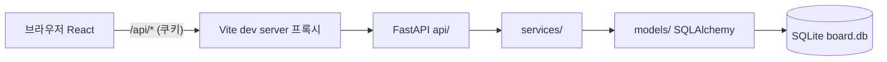

# board 설계

- 명세: docs/01_spec.md
- 상태: 확정 (M1 범위), M2 설계 반영(2026-10-03). M2 상세는 `docs/milestones/M2.md`
- 프로젝트 ADR: docs/adr/0001-auth-storage.md (승인), docs/adr/0002-project-lint-config.md (승인(PM 대행, 2026-10-04, 근거: STATUS.md 결정 기록))

## 개요
브라우저(React SPA)가 같은 출처의 `/api/*`로 FastAPI 백엔드를 호출하는 2계층 서비스다. 개발·E2E에서는 Vite 개발 서버가 `/api`를 백엔드로 프록시하므로 쿠키가 같은 출처에서 동작하고 CORS 설정이 필요 없다. 데이터는 SQLite 파일 하나에 저장한다(사용자, 세션, 게시글). 인증은 서버 세션 방식이다. 로그인하면 무작위 토큰을 HttpOnly 쿠키로 내려주고, 서버는 토큰의 SHA-256 해시를 `sessions` 테이블에 둔다. 백엔드 계층은 `api → services → models` 방향으로만 의존한다.



## 기술 스택
회사 표준(`/docs/adr/0001-standard-stack.md`)을 그대로 따른다. 표준에 없는 외부 라이브러리는 추가하지 않는다.

| 항목 | 선택 (버전 범위) | 이유 |
|---|---|---|
| 백엔드 언어 | Python 3.12 (`requires-python = ">=3.12"`) | 회사 표준 |
| 웹 프레임워크 | `fastapi>=0.115,<1`, `uvicorn>=0.30,<1` | 표준. uvicorn은 FastAPI 실행용 |
| DB 접근·마이그레이션 | `sqlalchemy>=2.0,<3`, `alembic>=1.13,<2` | 표준 |
| DB | SQLite 파일 | 표준, 명세 Q11 |
| 비밀번호 해시 | 표준 라이브러리 `hashlib.scrypt` | 표준. 외부 의존성 없음 (ADR 0001) |
| 백엔드 개발 도구 | `pytest>=9.0.3,<10`, `pytest-cov>=6,<8`, `httpx>=0.27,<1`, `ruff>=0.6,<1`, `pip-audit>=2.7,<3` | 표준 (TestClient에 httpx 필요). 버전 규칙은 아래 "백엔드 도구 버전 규칙" |
| 프론트엔드 | Node 22, React 18 + TypeScript(strict) + Vite(메이저는 아래 "프론트 도구 버전 규칙"), `react-router-dom` 6 | 표준 |
| 프론트 품질 | eslint 9(flat config) + `typescript-eslint` + `eslint-plugin-react`(`react/no-danger`) + `eslint-plugin-react-hooks`, prettier 3, `tsc --noEmit`(앱용 `tsconfig.json`과 Node용 `tsconfig.node.json` 두 설정으로 실행, `@types/node`는 Node용에만 지정) | 표준, frontend-standards |
| 프론트 테스트 | vitest + `@vitest/coverage-v8`(메이저는 아래 "프론트 도구 버전 규칙") + jsdom + `@testing-library/react`·`jest-dom`·`user-event` | 표준 |
| E2E | `@playwright/test` 1.56.1 (qa 소유, `tests/e2e/`) | 표준 |

프론트 도구 버전 규칙:
- `vite`, `vitest`, `@vitest/coverage-v8`은 `npm audit --audit-level=high`를 통과하는 **가장 낮은 메이저**를 쓴다. 조건: Node 22, React 18, `@vitejs/plugin-react`, eslint 9·`typescript-eslint`, Testing Library, jsdom과 함께 설치·실행된다(`npm install` 시 peer 의존성 오류 없음, `--force`·`--legacy-peer-deps` 금지).
- `vitest`와 `@vitest/coverage-v8`은 같은 버전으로 맞춘다. `@vitejs/plugin-react`는 선택한 vite 메이저를 peer로 지원하는 버전으로 맞춘다.
- 정확한 버전은 developer가 npm으로 확인해 `package.json`에 캐럿 범위(`^<메이저>.<마이너>.<패치>`)로 적고 `package-lock.json`에 고정한다. 선택한 버전은 T-06 완료 보고에 적는다.
- audit 기준(high)은 완화하지 않는다. `npm audit fix --force`, `overrides`로 취약점을 숨기는 방법은 쓰지 않는다. 조건을 만족하는 메이저가 없으면 PM에게 보고한다.
- `react-router-dom` 6은 유지한다(현재 moderate만 있어 high 기준 통과).
- 메이저를 올려 `vite.config.ts`의 설정 키(`test.coverage.thresholds` 등)나 `defineConfig` 가져오는 곳이 바뀌면 해당 메이저의 공식 문서를 따르되, M1.md "vite.config.ts" 절의 동작(프록시, jsdom, setupFiles, coverage 범위·임계값)은 그대로 유지한다.

백엔드 도구 버전 규칙:
- pytest는 9 메이저를 쓰고 하한을 취약점(PYSEC-2026-1845) 수정 버전 `9.0.3`으로 둔다(`pytest>=9.0.3,<10`). ADR 0001은 pytest 메이저를 고정하지 않으므로 표준 범위 안이다.
- `pytest-cov`는 pytest 9와 함께 설치·실행되는 버전이어야 한다. 범위는 `>=6,<8`로 넓혀 두고, developer가 `make setup` 후 실제 설치된 pytest·pytest-cov 버전을 확인해 `make coverage`가 동작하는지 본다. pip가 의존성 충돌을 보고하거나 `--cov` 옵션이 동작하지 않으면 범위를 임의로 바꾸지 말고 PM에게 보고한다.
- pytest 9로 올려도 `[tool.pytest.ini_options]`(`pythonpath = ["src"]`, `addopts = "--import-mode=importlib"`)와 테스트 실행 명령은 바꾸지 않는다. 9에서 제거된 사용 중단 기능 때문에 테스트가 깨지면 pytest 9 공식 문서의 대체 방법으로 테스트 코드를 고치되, 테스트를 지우거나 `skip`하지 않는다.
- venv 안의 pip도 `pip-audit` 검사 대상이므로 `make setup`은 venv를 만든 직후 `python -m pip install --upgrade pip`로 pip를 최신으로 올린다(아래 "실행 방법"). 같은 이유로 pip를 특정 버전에 고정하지 않는다.
- `make audit` 기준은 완화하지 않는다(`--ignore-vuln` 등 금지). 위 조치 후에도 실패하면 PM에게 보고한다.

- 백엔드 타입 검사 도구(mypy)는 표준에 없으므로 두지 않는다. 타입 힌트는 reviewer가 확인한다.
- 린트 설정은 저장소 루트 `board/ruff.toml` 하나에 둔다(ADR 0002). 내용은 회사 공통 `ruff.toml`(하네스 루트)의 규칙을 그대로 복사한 것이고, `extend` 등으로 저장소 밖 파일을 참조하지 않으며 규칙을 완화하지 않는다. `backend/pyproject.toml`에는 `[tool.ruff]`를 두지 않는다(두면 backend 파일에서 루트 설정을 가린다). `src`는 지정하지 않는다(기본값, import 분류가 회사 설정과 같음). 이렇게 하면 backend·tests의 모든 파이썬 파일이 실행 위치와 저장소 위치에 관계없이 같은 설정을 쓴다(완료 기준 D3).

## 폴더 구조
```
board/
├── Makefile                 # 루트 표준 명령 (하위 프로젝트 묶음)
├── .env.example
├── .gitignore               # env-setup 스킬 목록 그대로
├── ruff.toml                # 린트 설정 (회사 공통 규칙 복사본, ADR 0002)
├── backend/
│   ├── pyproject.toml       # 의존성, [tool.pytest.ini_options] ([tool.ruff] 없음)
│   ├── Makefile             # setup, check, lint, test, coverage, audit, dev, migrate, openapi
│   ├── alembic.ini
│   ├── migrations/
│   │   ├── env.py
│   │   └── versions/
│   │       ├── 0001_users_sessions.py      # M1
│   │       └── 0002_posts.py               # M2
│   └── src/board/
│       ├── __init__.py
│       ├── main.py          # create_app(), app
│       ├── config.py        # Settings, load_settings(), MAX_REQUEST_BODY_BYTES(M2)
│       ├── db.py            # Base, 엔진·세션 팩토리
│       ├── timeutil.py      # utc_now(), to_iso_utc()
│       ├── errors.py        # AppError 계층, 예외 처리기 등록
│       ├── openapi_export.py# make openapi 용
│       ├── models/          # user.py, session.py, post.py(M2)
│       ├── schemas/         # user.py, error.py, post.py(M2)
│       ├── services/        # passwords.py, validation.py, users.py, sessions.py, posts.py(M2)
│       └── api/             # deps.py, middleware.py(M2: 본문 상한·보안 헤더 추가), users.py, auth.py, posts.py(M2)
├── frontend/
│   ├── package.json, package-lock.json, index.html
│   ├── tsconfig.json        # 앱·테스트용: include ["src"], types [vite/client, vitest/globals, @testing-library/jest-dom]
│   ├── tsconfig.node.json   # Node 실행 설정 파일용: include ["vite.config.ts"], lib ES2022(DOM 없음), types ["node"]
│   ├── vite.config.ts, eslint.config.js, .prettierrc.json, .prettierignore
│   └── src/
│       ├── main.tsx, App.tsx
│       ├── api/             # client.ts, auth.ts, posts.ts(M2)
│       ├── types/           # api.ts
│       ├── hooks/           # useAuth.ts
│       ├── utils/           # datetime.ts(formatKst), postId.ts(parsePostId)  (M2)
│       ├── components/      # AuthProvider.tsx, Header.tsx, LoginRequired.tsx·PostNotFound.tsx·PostForm.tsx(M2) (+ *.test.tsx)
│       ├── pages/           # SignupPage, LoginPage, NotFoundPage, PostListPage·PostDetailPage·PostNewPage·PostEditPage(M2. HomePage는 M2에서 삭제) (+ *.test.tsx)
│       └── test/setup.ts    # jest-dom 등록
├── tests/
│   ├── unit/backend/        # 백엔드 단위 테스트 (developer). conftest.py 포함
│   ├── acceptance/          # 백엔드 인수 테스트 (qa, pytest + TestClient)
│   └── e2e/                 # Playwright (qa)
└── docs/
```
- 프론트엔드 단위 테스트는 frontend-standards에 따라 `frontend/src/**/*.test.ts(x)`로 같은 폴더에 둔다.
- 백엔드 테스트는 `backend/`에서 pytest를 실행하고 `../tests/unit/backend`, `../tests/acceptance`를 경로로 넘긴다. `[tool.pytest.ini_options]`: `pythonpath = ["src"]`, `addopts = "--import-mode=importlib"`. importlib 모드에서는 테스트 파일끼리 import하지 않고 공용 코드는 `conftest.py` 픽스처로만 공유한다.

## 공통 데이터 모델
- 저장: SQLite 파일 하나. 기본 경로는 `backend/board.db`(`DATABASE_URL`). 스키마는 Alembic 마이그레이션으로만 바꾼다. 테스트는 `Base.metadata.create_all()`로 만든 임시 DB(`tmp_path`의 파일)를 쓴다.
- 시각: DB에는 **naive UTC** `DateTime`으로 저장한다. 코드의 현재 시각은 항상 `timeutil.utc_now()`(naive UTC)를 쓴다. API 응답에서는 `to_iso_utc()`로 `YYYY-MM-DDTHH:MM:SSZ` 문자열을 만든다. KST 표시 변환은 프론트엔드가 맡는다(M2, Q6).
- SQLite 엔진: `connect_args={"check_same_thread": False}`, 연결마다 `PRAGMA foreign_keys=ON`(SQLAlchemy `connect` 이벤트).

### DB 스키마 (M1)
| 테이블 | 컬럼 | 제약·인덱스 |
|---|---|---|
| `users` | `id` INTEGER PK, `username` VARCHAR(20) NOT NULL, `password_hash` VARCHAR(255) NOT NULL, `created_at` DATETIME NOT NULL | `username` UNIQUE 인덱스 (`ix_users_username`) |
| `sessions` | `id` INTEGER PK, `token_hash` CHAR(64) NOT NULL, `user_id` INTEGER NOT NULL FK→users.id ON DELETE CASCADE, `created_at` DATETIME NOT NULL, `expires_at` DATETIME NOT NULL | `token_hash` UNIQUE 인덱스, `user_id` 인덱스 |

- `users.username`: 항상 소문자로 정규화된 값만 저장한다(Q1). 그래서 대소문자 무시 중복 검사는 UNIQUE 제약으로 충분하다.
- `users.password_hash`: `scrypt$16384$8$1$<salt_b64>$<hash_b64>` 형식(ADR 0001). 평문은 저장하지 않는다.
- `sessions.token_hash`: 쿠키 토큰의 SHA-256 hex. 원본 토큰은 저장하지 않는다.
### DB 스키마 (M2 추가, 마이그레이션 `0002_posts.py`)
| 테이블 | 컬럼 | 제약·인덱스 |
|---|---|---|
| `posts` | `id` INTEGER PK, `title` VARCHAR(100) NOT NULL, `content` TEXT NOT NULL, `author_id` INTEGER NOT NULL FK→users.id, `created_at` DATETIME NOT NULL | `(created_at, id)` 인덱스 (`ix_posts_created_at_id`, 목록 정렬용), `author_id` 인덱스 (`ix_posts_author_id`) |

- `posts.title`·`content`: 입력 그대로 저장한다(앞뒤 공백을 자르지 않고, HTML을 이스케이프하지 않음. AC-25는 화면이 텍스트로 그려서 막는다). 내용 필드 이름을 `body`로 하지 않은 이유는 M2.md "이 마일스톤에서 정한 것".
- 수정 시각 컬럼은 두지 않는다(Q6: "수정됨" 표시 불필요). 수정해도 `created_at`과 목록 순서는 바뀌지 않는다.
- 목록 정렬: `created_at` 내림차순, 같은 시각(초 단위로 저장)이면 `id` 내림차순.

- 삭제 정책: 회원 탈퇴 기능이 없으므로 `users`는 삭제하지 않는다(그래서 `posts.author_id` FK에 `ON DELETE`를 지정하지 않는다). `sessions`는 로그아웃할 때와 만료된 세션이 조회될 때 물리 삭제한다. `posts`는 작성자가 삭제하면 **물리 삭제**하며 복구할 수 없다(Q7). 댓글·첨부가 없으므로 함께 지울 연관 데이터는 없다.

## API 계약
공통 규칙:
- 모든 경로는 `/api/` 아래. 요청·응답 본문은 JSON. 시간은 UTC ISO 8601(`...Z`).
- 인증: 쿠키 `board_session`. 속성은 `HttpOnly; SameSite=Lax; Path=/; Max-Age=604800`이고, `SESSION_COOKIE_SECURE=true`이면 `Secure`를 붙인다.
- CSRF 완화: `/api/` 아래 POST·PUT·PATCH·DELETE는 `Content-Type`의 미디어 타입이 `application/json`이어야 한다. 아니면 **415** `unsupported_media_type`. 본문이 없는 요청(로그아웃, M2의 삭제)도 이 헤더를 보낸다.
- 본문 크기(M2): `/api/` 아래 POST·PUT·PATCH·DELETE에 다음 순서로 판정한다. ① `Transfer-Encoding` 헤더가 있으면 `Content-Length`와 관계없이 **411** `length_required` ② `Content-Length` 헤더가 2개 이상이면 411 ③ `Content-Length`가 (앞뒤 공백을 지운 뒤) ASCII 10진 숫자가 아니면 411, 65536바이트(64 KiB)를 넘으면 **413** `payload_too_large`. 두 헤더가 모두 없으면 통과. 전체 판정 순서는 415 → 411/413 → 라우터. 세부 규칙은 M2.md `register_body_limit_middleware`.
  - 서버 파서가 먼저 거부하는 경우: 실제 서버(uvicorn + h11)는 `Transfer-Encoding: identity`처럼 chunked가 아닌 전송 인코딩, 비정상 `Content-Length`(숫자 아님, 5000자 같은 과도한 길이), 값이 서로 다른 중복 `Content-Length`를 앱에 닿기 전에 자체 **400**으로 거부할 수 있다(이 응답은 앱의 오류 형식·보안 헤더가 없을 수 있다). 값이 같은 중복 `Content-Length`는 하나로 합쳐져 앱의 ②에 걸리지 않고 라우터까지 오지만, 서버가 그 길이만큼만 읽으므로 우회가 아니다. 앱 계층의 411/413 규칙은 다른 ASGI 서버를 위한 방어로 그대로 유지하며 단위 테스트(TestClient)로 검증한다. 실제 서버를 쓰는 테스트는 이런 요청을 "400 또는 411/413, 500·2xx 아님, DB 변화 없음"으로 판정한다.
- 보안 응답 헤더(M2): 백엔드의 모든 응답(처리되지 않은 예외의 500 포함)에 `X-Content-Type-Options: nosniff`, `X-Frame-Options: DENY`, `Content-Security-Policy: default-src 'none'; frame-ancestors 'none'`.
- 백엔드는 `/docs`, `/redoc`, `/openapi.json`을 제공하지 않는다(404). OpenAPI 문서는 `make openapi`로만 만든다.
- CORS를 열지 않는다. `CORSMiddleware`와 `Access-Control-Allow-*` 헤더를 두지 않는다(CSRF 방어의 전제. 보안 리뷰 M1 Minor #3).
- 오류 형식: `{ "error": { "code": string, "message": string, "details"?: FieldError[] } }`
  - `FieldError = { "field": string, "message": string }`
- 응답 어디에도 `password`, `password_hash` 필드나 해시 값을 넣지 않는다 (AC-10).

### 스키마
```
User = { "id": int, "username": string, "created_at": string(ISO 8601, UTC) }
```

### POST /api/users — 회원가입
- 인증: 불필요
- 요청: `{ "username": string, "password": string }`
  - username: 영문 대소문자·숫자·밑줄 4~20자. 서버가 소문자로 바꿔 저장한다. 앞뒤 공백은 자르지 않는다(공백이 있으면 형식 오류).
  - password: 8~72자(문자 수 기준). 문자 조합 제한은 없다. 단, UTF-8로 인코딩할 수 없는 문자(JSON `"\ud800"`처럼 짝이 없는 서로게이트)는 유효한 문자가 아니므로 422로 거부한다.
- 응답 201: `User`
- 오류: 409 `username_taken`, 415 `unsupported_media_type`, 422 `validation_error`(필드별 `details`)
- 관련 AC: AC-1, AC-2, AC-3, AC-4, AC-5, AC-10

### POST /api/auth/login — 로그인
- 인증: 불필요
- 요청: `{ "username": string, "password": string }` (username은 소문자로 바꿔 조회한다)
- 응답 200: `User` + `Set-Cookie: board_session=<token>; HttpOnly; SameSite=Lax; Path=/; Max-Age=604800[; Secure]`
- 오류: 401 `invalid_credentials`(아이디가 없거나 비밀번호가 틀리거나 형식이 맞지 않는 모든 경우에 같은 메시지), 415, 422 `validation_error`(필드 누락·문자열 아님)
- 관련 AC: AC-6, AC-7, AC-10

### POST /api/auth/logout — 로그아웃
- 인증: 선택 (쿠키가 없거나 무효해도 204)
- 요청: `{}` (Content-Type: application/json)
- 응답 204: 쿠키의 세션 행을 삭제하고 `Set-Cookie: board_session=""; Max-Age=0; Path=/; HttpOnly; SameSite=Lax`로 쿠키를 지운다
- 오류: 415
- 관련 AC: AC-9

### GET /api/auth/me — 현재 사용자
- 인증: 필요
- 응답 200: `User`
- 오류: 401 `unauthenticated`(쿠키 없음, 모르는 토큰, 만료된 세션, 로그아웃된 세션)
- 관련 AC: AC-8, AC-9

### M2 게시글 API
M1 구조(오류 계층, `get_current_user`, `client.ts`)를 그대로 재사용한다. 인터페이스 상세는 M2.md.

#### 스키마 (M2)
```
UserPublic  = { "id": int, "username": string }
PostSummary = { "id": int, "title": string, "author": UserPublic, "created_at": string(ISO 8601, UTC) }
Post        = { "id": int, "title": string, "content": string, "author": UserPublic, "created_at": string(ISO 8601, UTC) }
PostPage    = { "items": PostSummary[], "total": int, "page": int, "size": int }   // size는 항상 10
PostWrite   = { "title": string, "content": string }
```
- `title`: `strip()` 후 비어 있지 않고 1~100자(코드 포인트 수, 공백 포함). `content`: 같은 규칙으로 1~5000자, 줄바꿈 유지. 둘 다 UTF-8로 인코딩할 수 없는 문자(짝 없는 서로게이트)는 거부.
- 응답의 `author`에는 `id`, `username`만 있다(AC-10 유지).

#### GET /api/posts — 목록
- 인증: 불필요
- 쿼리: `page`(선택, 문자열 그대로 받음). `size`는 받지 않는다(10 고정, 다른 쿼리는 무시).
  - 보정(Q4, AC-14): 없거나 `-?[0-9]+`(ASCII) 형식이 아니면 1, 1 미만이면 1, 마지막 페이지를 넘으면 마지막 페이지. 마지막 페이지 = `max(1, ceil(total / 10))`. 이 경우 모두 **200**이며 422를 내지 않는다.
  - 앞에 0이 붙은 값은 숫자의 값으로 해석한다(`0000000005` → 5, `000` → 0 → 1). 너무 큰 값은 앞의 0을 뺀 유효 숫자가 9자리를 넘을 때로 판정해 양수는 마지막 페이지, 음수는 1로 보정한다(상세 규칙: M2.md `parse_page`).
- 응답 200: `PostPage` (`page`는 보정된 값. 글이 없으면 `items=[]`, `total=0`, `page=1`)
- 정렬: 작성 시각 최신순(같으면 id 큰 순)
- 오류: 없음(500 제외)
- 관련 AC: AC-11, AC-12, AC-13, AC-14

#### POST /api/posts — 작성
- 인증: 필요
- 요청: `PostWrite`
- 응답 201: `Post` (`author`는 로그인한 사용자)
- 오류: 401 `unauthenticated`, 411, 413, 415, 422 `validation_error`(필드별 `details`, field=`title`/`content`)
- 관련 AC: AC-17, AC-18, AC-19, AC-20, AC-25

#### GET /api/posts/{post_id} — 상세
- 인증: 불필요
- 경로: `post_id`는 `[1-9][0-9]{0,18}` 형식이고 2^63-1 이하인 정수여야 한다. 아니면(`0`, `-1`, `abc`, `01`, 범위 초과) 없는 글과 같이 404.
- 응답 200: `Post`
- 오류: 404 `post_not_found`
- 관련 AC: AC-15, AC-16, AC-25

#### PUT /api/posts/{post_id} — 수정
- 인증: 필요. **작성자 본인만** 가능
- 요청: `PostWrite` (제목·내용 둘 다 보낸다. 검증 규칙은 작성과 같다)
- 응답 200: `Post` (`created_at`, `author`는 바뀌지 않음)
- 오류 (판정 순서): 401 `unauthenticated` → 422 `validation_error`(본문 JSON·필드 형식 오류) → 404 `post_not_found` → **403 `forbidden`**(로그인한 사용자가 작성자가 아님. 글은 변하지 않는다) → 422 `validation_error`(빈 값·길이·문자). 남의 글에는 내용이 잘못돼도 403이다. 그 밖에 411, 413, 415
- 관련 AC: AC-21, AC-24

#### DELETE /api/posts/{post_id} — 삭제
- 인증: 필요. **작성자 본인만** 가능
- 요청: 본문 `{}`, `Content-Type: application/json`
- 응답 204: 본문 없음. 글을 물리 삭제한다. 이후 상세는 404, 목록에서 빠진다
- 오류 (판정 순서): 401 `unauthenticated` → 404 `post_not_found` → **403 `forbidden`**(작성자가 아님. 글은 변하지 않는다). 그 밖에 411, 413, 415
  - 참고(OpenAPI): 경로 인자가 있으면 FastAPI가 422를 자동으로 붙이므로, 생성 문서에는 422가 `ErrorResponse` 형식으로 선언되어 있다. 이 엔드포인트에서는 검증에 실패할 입력이 없어 실제로는 422가 나오지 않는다. 계약상 오류 목록은 위 항목이 전부다
- 관련 AC: AC-22, AC-24

#### 권한 요약 (AC-23, AC-24)
| 요청자 | 목록·상세 GET | 작성 POST | 남의 글 PUT·DELETE | 내 글 PUT·DELETE |
|---|---|---|---|---|
| 비로그인 | 200 | 401 `unauthenticated` | 401 `unauthenticated` | (해당 없음) |
| 로그인 | 200 | 201 | 403 `forbidden` | 200 / 204 |

화면은 이 표와 일치하게 수정·삭제 버튼을 작성자 본인의 상세 화면에서만 보여 준다(AC-23). 서버 권한 검사는 화면과 무관하게 서비스 계층(`services/posts.py::ensure_author`)에서 한다.

## 오류 처리
`errors.py`의 `AppError` 하위 클래스를 서비스가 던지고, `main.py`에 등록된 처리기가 HTTP 응답으로 바꾼다. 예외 클래스 이름은 하네스 ruff 규칙 N818에 따라 모두 `Error`로 끝난다.

| 상황 | 예외 / 출처 | HTTP | code | message |
|---|---|---|---|---|
| 가입 필드 검증 실패 | `ValidationFailedError` | 422 | `validation_error` | "입력값을 확인해 주세요." + `details` |
| 요청 본문 누락·타입 오류 (Pydantic) | `RequestValidationError` | 422 | `validation_error` | "입력값을 확인해 주세요." + `details`(오류 항목마다 1개. field=아래 "검증 오류 field 규칙", message="형식이 올바르지 않습니다.") |
| 아이디 중복 | `UsernameTakenError` | 409 | `username_taken` | "이미 사용 중인 아이디입니다." |
| 로그인 실패 | `InvalidCredentialsError` | 401 | `invalid_credentials` | "아이디 또는 비밀번호가 올바르지 않습니다." |
| 미인증 | `NotAuthenticatedError` | 401 | `unauthenticated` | "로그인이 필요합니다." |
| JSON이 아닌 상태 변경 요청 | 미들웨어 | 415 | `unsupported_media_type` | "JSON 형식으로 요청해 주세요." |
| 글 필드 검증 실패 (M2) | `ValidationFailedError` | 422 | `validation_error` | "입력값을 확인해 주세요." + `details`(아래 "글 필드 메시지") |
| 없는 글, 형식이 잘못된 글 ID (M2) | `PostNotFoundError` | 404 | `post_not_found` | "게시글을 찾을 수 없습니다." |
| 남의 글 수정·삭제 (M2) | `ForbiddenError` | 403 | `forbidden` | "본인이 작성한 글만 수정하거나 삭제할 수 있습니다." |
| 본문 크기 초과 (M2) | 미들웨어 | 413 | `payload_too_large` | "요청 본문이 너무 큽니다." |
| 본문 길이를 알 수 없음 (M2): `Transfer-Encoding` 있음(Content-Length 유무 무관), Content-Length 중복, 숫자 아님 | 미들웨어 | 411 | `length_required` | "요청 본문의 길이를 알 수 없습니다." |
| 없는 경로 | Starlette `HTTPException` 404 | 404 | `not_found` | "요청한 경로를 찾을 수 없습니다." |
| 허용되지 않은 메서드 | Starlette `HTTPException` 405 | 405 | `method_not_allowed` | "허용되지 않은 요청 방식입니다." |
| 그 밖의 HTTPException | Starlette `HTTPException` | 원래 상태 | `http_error` | "요청을 처리할 수 없습니다." |
| 예상하지 못한 예외 | `Exception` 처리기 | 500 | `internal_error` | "일시적인 오류가 발생했습니다." (스택 트레이스는 로그에만 남김. M2부터 보안 응답 헤더 3개를 처리기가 직접 붙인다) |

가입 필드 메시지 (`details[].message`):
| field | 조건 | message |
|---|---|---|
| username | 빈 문자열 또는 공백뿐 | "아이디를 입력해 주세요." |
| username | 형식 위반(`[A-Za-z0-9_]{4,20}` 전체 일치가 아님) | "아이디는 영문 소문자, 숫자, 밑줄(_)로 4~20자여야 합니다." |
| password | 8자 미만(빈 값 포함) | "비밀번호는 8자 이상이어야 합니다." |
| password | 72자 초과 | "비밀번호는 72자 이하여야 합니다." |
| password | 길이는 8~72자이지만 UTF-8로 인코딩할 수 없는 문자(짝 없는 서로게이트)가 있음 | "비밀번호에 사용할 수 없는 문자가 포함되어 있습니다." |

username과 password 오류는 함께 모아 `details`에 둘 다 넣는다(username 먼저). 필드마다 오류는 최대 1개이며 password는 위 표의 순서(최소 길이 → 최대 길이 → 인코딩 불가)로 처음 해당하는 것 하나만 낸다.

글 필드 메시지 (M2, `details[].message`). 필드마다 아래 순서로 처음 해당하는 오류 하나만 내고, 두 필드 오류는 함께 모은다(title 먼저):
| field | 조건 | message |
|---|---|---|
| title | `strip()` 결과가 빈 문자열 | "제목을 입력해 주세요." |
| title | 100자 초과 | "제목은 100자 이하여야 합니다." |
| title | UTF-8로 인코딩할 수 없는 문자 | "제목에 사용할 수 없는 문자가 포함되어 있습니다." |
| content | `strip()` 결과가 빈 문자열 | "내용을 입력해 주세요." |
| content | 5000자 초과 | "내용은 5000자 이하여야 합니다." |
| content | UTF-8로 인코딩할 수 없는 문자 | "내용에 사용할 수 없는 문자가 포함되어 있습니다." |

로그인에서는 인코딩 불가 문자가 든 비밀번호도, 인코딩 불가 문자가 든 아이디도 다른 실패와 똑같이 401 `invalid_credentials`로 응답한다(구분하지 않음, AC-7).

로그인 실패는 응답 시간으로도 아이디 존재 여부가 드러나면 안 된다(AC-7). 그래서 비밀번호 72자 초과 검사는 사용자 조회보다 먼저 해서 아이디와 무관하게 바로 401을 내고, 그 밖의 경우에는 있는 아이디(`verify_password`)와 없는 아이디(`verify_dummy`)가 같은 횟수의 scrypt를 치른다. 상세 순서는 M1.md `authenticate`.

검증 오류 field 규칙 (`RequestValidationError` → `details[].field`):
- Pydantic 오류 항목의 `loc`에서 **문자열인 요소 중 마지막 것**을 쓴다. 정수(목록 인덱스, JSON 파싱 오류 위치)는 건너뛴다.
- `loc`이 없거나 비어 있거나 문자열 요소가 없으면 `"body"`.

| 상황 | loc 예 | field |
|---|---|---|
| 필드 누락·문자열 아님 | `("body", "username")` | `"username"` |
| 잘못된 JSON 본문 | `("body", 1)` | `"body"` |
| 최상위가 객체가 아닌 본문(배열 등) | `("body",)` | `"body"` |
| 목록 항목 오류(M2 이후 해당 시) | `("body", "tags", 0)` | `"tags"` |
| 쿼리 파라미터 오류 (M2에서는 `?page=`를 문자열로 받아 보정하므로 발생하지 않음) | `("query", "page")` | `"page"` |

프론트엔드: `api/client.ts`가 오류 응답을 `ApiError(status, code, message, details)`로 바꾼다. 응답이 JSON 오류 형식이 아니면 `code="unknown_error"`, message "일시적인 오류가 발생했습니다."로, 네트워크 실패면 `status=0`, `code="network_error"`, message "서버에 연결할 수 없습니다."로 바꾼다.

프론트엔드 로그아웃 실패: 로그인 상태의 출처는 `AuthProvider`의 `user` 하나다. `POST /api/auth/logout`이 성공하거나 401이면(서버 세션이 이미 없음) `user=null`로 바꾸고, 그 밖의 실패(네트워크, 500 등)면 로그인 상태를 유지하고 Header에 `<p role="alert">로그아웃하지 못했습니다. 다시 시도해 주세요.</p>`를 보여 재시도하게 한다. 실패를 성공처럼 보이지 않게 하는 것이 목적이다(서버 세션이 살아 있으면 HttpOnly 쿠키를 프론트에서 지울 수 없음, AC-9). 요청 중에는 로그아웃 버튼을 비활성화한다. 상세 계약과 AuthProvider·Header 역할 분담은 M1.md "logout 계약"·"components/Header.tsx".

## 설정 (환경변수)
| 변수 | 사용처 | 기본값 | 설명 |
|---|---|---|---|
| `DATABASE_URL` | backend | `sqlite:///./board.db` | SQLAlchemy URL. 상대 경로는 `backend/` 기준 |
| `SESSION_COOKIE_SECURE` | backend | `false` | `true`/`1`/`yes`면 쿠키에 Secure를 붙인다. `false`/`0`/`no`/빈 값이면 끈다. 그 밖의 값이면 시작할 때 `ValueError` (Q11: HTTPS 종단 환경에서 true) |
| `API_PROXY_TARGET` | frontend `vite.config.ts` | `http://127.0.0.1:8000` | 개발 서버가 `/api`를 넘길 백엔드 주소 |
| `VITE_API_BASE_URL` | frontend `client.ts` | `""` (같은 출처) | API 기본 URL |

- 세션 유지 기간 7일(Q3)은 `Settings.session_ttl` 기본값(`timedelta(days=7)`)으로 고정하고 환경변수로 받지 않는다. 테스트에서는 `Settings`를 직접 만들어 바꾼다.
- 비밀값이 필요 없다(세션 토큰은 서명하지 않는 무작위 값). `.env.example`에는 위 4개를 설명과 함께 적는다.
- 루트 Makefile은 `-include .env`와 `export`로 `.env`를 읽는다. 테스트는 `.env` 없이 돈다.
- `board.main`은 import 시점에 `app = create_app()`로 설정을 읽는다. 그래서 셸이나 `.env`의 `SESSION_COOKIE_SECURE`가 허용 목록 밖이면 서버 시작과 테스트 수집이 모두 `ValueError`로 실패한다. 의도된 동작(잘못된 설정을 일찍 드러냄)이므로 바꾸지 않고, README의 문제 해결 항목에 "테스트가 수집 단계에서 ValueError로 실패하면 `SESSION_COOKIE_SECURE` 값을 확인한다"를 적는다.

## 실행 방법
요구 사항: Python 3.12, Node 22, (E2E) Playwright chromium.

| 명령 | 하는 일 |
|---|---|
| `make setup` | 백엔드: ① `python3 -m venv .venv`로 `backend/.venv` 생성 → ② `.venv/bin/python -m pip install --upgrade pip`(pip 최신화, pip-audit 대상) → ③ `.venv/bin/python -m pip install -e ".[dev]"`. 프론트: `cd frontend && npm ci` |
| `make check` | 백엔드: `ruff check` + `ruff format --check`(backend, tests/unit/backend, tests/acceptance. 설정은 `board/ruff.toml`) → `pytest -q ../tests/unit/backend $(wildcard ../tests/acceptance)`. 프론트: `npm run lint` → `format:check` → `typecheck` → `test`. **품질 게이트가 사용** |
| `make dev` | `make -j2 dev-backend dev-frontend` |
| `make dev-backend` | `cd backend && alembic upgrade head && uvicorn board.main:app --host 127.0.0.1 --port 8000 --reload` |
| `make dev-frontend` | `cd frontend && npm run dev -- --host 127.0.0.1 --port 5173 --strictPort` → http://127.0.0.1:5173 |
| `make e2e` | `cd tests/e2e && npm ci && npx playwright test` |
| `make e2e-backend` | `tests/e2e/e2e.db`를 지운 뒤 `DATABASE_URL=sqlite:///$(CURDIR)/tests/e2e/e2e.db`로 `alembic upgrade head`를 실행하고, uvicorn을 `127.0.0.1:8001`로 띄운다(`--reload` 없음). Playwright `webServer`가 호출 |
| `make e2e-frontend` | `cd frontend && API_PROXY_TARGET=http://127.0.0.1:8001 npm run dev -- --host 127.0.0.1 --port 5174 --strictPort`. Playwright `webServer`가 호출 |
| `make audit` | `backend/.venv/bin/pip-audit --skip-editable`, `cd frontend && npm audit --audit-level=high` |
| `make coverage` | 백엔드 `pytest --cov=board --cov-fail-under=80 ../tests/unit/backend $(wildcard ../tests/acceptance)`, 프론트 `npm run coverage`(lines·functions 70% 임계값은 `vite.config.ts`에 둔다) |
| `make openapi` | `python -m board.openapi_export ../docs/api/openapi.json` (PM이 최종 검수 때 실행) |

테스트 명령 요약:
- 백엔드 단위·인수: `make -C backend test` (= `cd backend && .venv/bin/python -m pytest -q ../tests/unit/backend $(wildcard ../tests/acceptance)`)
- 프론트 단위: `cd frontend && npm run test`
- E2E: `make e2e` (qa의 `playwright.config.ts`가 `webServer`로 `make -C <루트> e2e-backend`와 `e2e-frontend`를 띄운다. `baseURL`은 `http://127.0.0.1:5174`, 백엔드 준비 확인 URL은 `http://127.0.0.1:8001/api/auth/me`(401이 정상))

포트: 개발 백엔드 8000 / 프론트 5173, E2E 백엔드 8001 / 프론트 5174.

`frontend/package.json` scripts: `dev`(vite), `build`(npm run typecheck && vite build), `lint`(eslint .), `format`(prettier --write .), `format:check`(prettier --check .), `typecheck`(tsc --noEmit -p tsconfig.json && tsc --noEmit -p tsconfig.node.json), `test`(vitest run), `coverage`(vitest run --coverage).
- 타입 검사 범위: `-p tsconfig.json`은 `src/` 전체(테스트 포함), `-p tsconfig.node.json`은 `vite.config.ts`만 검사한다. 인자 없는 `tsc --noEmit`은 `tsconfig.json`만 보므로 `vite.config.ts`가 빠진다. 그래서 `typecheck`는 두 설정을 `&&`로 이어 실행한다.
- `build`는 타입 검사 명령을 따로 쓰지 않고 `npm run typecheck`를 거친다. 타입 검사 범위를 `typecheck` 한 곳에서만 정해 `make check`와 `build`가 같은 파일을 검사하게 하기 위함이다.
- 프론트용 tsconfig를 더 추가하면(예: 테스트용 분리) `typecheck`에 `-p` 항목을 함께 추가한다. `build`는 바꿀 필요가 없다.

배포: 명세 범위 밖이다. 운영 환경에서는 사내 리버스 프록시가 `/api`를 백엔드로 넘기고 `frontend/dist` 정적 파일을 서빙한다고 가정한다. 이 가정에 다음을 포함하며, PM이 README "운영 안내"에 그대로 적는다(보안 리뷰 M1 Minor #1·#2).
- 프록시는 `/api/` 경로만 백엔드로 넘긴다(백엔드 자체도 `/docs`·`/openapi.json`을 끈다).
- 프록시의 요청 본문 상한을 64 KiB로 둔다(예: nginx `client_max_body_size 64k`). 백엔드도 `Content-Length` 기준으로 같은 상한을 검사하지만, 프록시 상한이 1차 방어다.
- 정적 HTML 응답에 보안 헤더를 붙인다: `Content-Security-Policy: default-src 'self'; frame-ancestors 'none'; object-src 'none'; base-uri 'self'`, `X-Content-Type-Options: nosniff`, `X-Frame-Options: DENY`. (API 응답의 헤더는 백엔드가 붙인다. Vite 개발 서버에는 적용하지 않는다)
- HTTPS 종단을 두고 `SESSION_COOKIE_SECURE=true`로 실행한다(Q11).
- CORS를 열지 않는다(같은 출처로만 서비스).

## 마일스톤
| ID | 이름 | 포함 AC | 선행 | 설계 문서 |
|---|---|---|---|---|
| M1 | 회원가입·로그인 | AC-1 ~ AC-10 | - | docs/milestones/M1.md (T-01 ~ T-09) |
| M2 | 게시글 | AC-11 ~ AC-25 | M1 | docs/milestones/M2.md (T-10 ~ T-18) |

M2 화면 라우트: `/`(목록, M1의 HomePage를 대체), `/posts/new`(글쓰기), `/posts/:id`(상세·삭제), `/posts/:id/edit`(수정). 이동 경로와 URL 값 사용 규칙은 M2.md "보안 조건".

## 최종 검수 보정 태스크
마일스톤에 속하지 않고 최종 검수(D1~D7) 중 발견된 문제를 고치는 태스크다. 관련 AC 없음(완료 기준 D3).

| ID | 내용 | 선행 | 예상 파일 |
|---|---|---|---|
| T-20 | 린트 설정을 저장소 안으로 옮긴다(ADR 0002). **r1 반려 후 수정 범위**(docs/reviews/T-20-r1.md): 아래 ①~④ | - | ruff.toml(신규, 저장소 루트), backend/pyproject.toml |

T-20 수정 범위:
1. 저장소 루트에 `ruff.toml`을 만든다. 내용은 ADR 0002 "결정 2"의 항목만 회사 `ruff.toml`과 같은 값으로 적는다(`line-length`, `target-version`, `[lint] select`, `[lint.per-file-ignores]`의 `"**/cli.py"`, `"**/tests/**"`). 첫머리 주석: 회사 공통 규칙의 복사본이며 extend 금지, 회사 규칙이 바뀌면 같이 바꾼다. `src`, `extend`, `"../tests/**"`는 쓰지 않는다.
2. `backend/pyproject.toml`에서 r1에 추가한 `[tool.ruff]`, `[tool.ruff.lint]`, `[tool.ruff.lint.per-file-ignores]` 절과 그 주석을 모두 지운다. 다른 절은 바꾸지 않는다.
3. `backend/Makefile`, 루트 `Makefile`, 소스·테스트 코드는 바꾸지 않는다. 린트 오류가 나와도 코드를 고치거나 규칙을 끄지 말고 PM에게 보고한다(규칙이 같으므로 0건이어야 한다. 특히 I001이 나오면 import 분류가 달라졌다는 뜻이다).
4. 완료 확인(완료 보고에 결과를 적는다):
   - `make check` 통과.
   - `backend/`에서 `.venv/bin/python -m ruff check --show-settings <파일>`을 `src/board/main.py`, `../tests/unit/backend/conftest.py`, `../tests/acceptance/` 안의 파일 1개에 각각 실행해 `Settings path`가 모두 `<저장소>/ruff.toml`이고 `/home/user/AI_assistant/ruff.toml`이 아님을 확인.
   - 규칙 동등성: `--show-settings`의 `linter.rules.enabled`, `line_length`, `target_version`, `formatter.line_width`가 회사 `ruff.toml`을 `--config`로 강제했을 때와 같음.
   - 다른 위치 클론에서의 `make setup` → `make check`는 PM이 최종 검수 D3 재확인 때 실행한다.

`board`를 first-party로 분류하도록 바꾸는 import 재정렬은 하지 않는다(ADR 0002 "결정 3"). 그래서 별도 태스크를 만들지 않는다.

## 변경 이력
| 날짜 | 바뀐 부분 | 이유 |
|---|---|---|
| 2026-10-03 | 최초 작성 (M1 상세, M2 자리) | 명세 승인 |
| 2026-10-03 | "오류 처리" 표의 예외 이름을 `ValidationFailedError`, `UsernameTakenError`, `InvalidCredentialsError`, `NotAuthenticatedError`로 변경(`AppError` 유지, code·message·HTTP 상태는 그대로). Error 접미사 규칙 명시 | 하네스 ruff N818 위반 (T-02 developer 보고) |
| 2026-10-03 | "설정"에 import 시점 설정 검증이 테스트 수집에도 영향을 준다는 점과 README 안내 문구를 추가(동작은 유지) | T-01 리뷰 r1 Minor #4 (architect 담당) |
| 2026-10-03 | 상단 ADR 0001 표기를 "승인"으로 변경 | PM 전달: 대표 승인(대행 기록) |
| 2026-10-03 | 가입 password 규칙과 "가입 필드 메시지"에 UTF-8 인코딩 불가 문자(짝 없는 서로게이트) 거부 행 추가, 필드당 오류 1개·순서 명시, 로그인에서는 401로 동일 처리 명시 | T-03 리뷰 r1 Minor #1: `hash_password`가 UnicodeEncodeError를 던져 가입이 500이 될 위험. 인코딩 방식(surrogatepass 등)을 정하는 대신 유효하지 않은 유니코드를 입력 단계에서 거부하는 쪽이 가장 단순하고 해시 형식(ADR 0001)을 바꾸지 않음. 표준 스택 범위 안이라 ADR 없음 |
| 2026-10-03 | "오류 처리"에 로그인 시 인코딩 불가 아이디도 같은 401임을 추가하고, 72자 초과 검사를 사용자 조회보다 먼저 하며 scrypt 횟수가 아이디 존재와 무관해야 한다는 타이밍 규칙 추가 | T-05 리뷰 r1 Major #1(72자 초과 비밀번호에서 있는 아이디 0.24 ms, 없는 아이디 52 ms로 아이디 존재가 드러남)·Minor #2(인코딩 불가 아이디 처리 미기재) |
| 2026-10-03 | "기술 스택"의 Vite 5·vitest 2 고정을 없애고 "프론트 도구 버전 규칙" 추가: vite·vitest·`@vitest/coverage-v8`은 `npm audit --audit-level=high`를 통과하는 가장 낮은 메이저(Node 22·React 18·eslint·Testing Library 호환), 정확한 버전은 developer가 npm으로 확정해 lock에 고정. `react-router-dom` 6 유지 | T-06 developer 보고: vite 5.4.21(high), vitest 2.1.9(critical), @vitest/coverage-v8 2.1.9에서 audit 실패, 같은 메이저 안 해결 불가. PM 결정: audit 기준 유지, 메이저 상향. ADR 0001은 Vite·vitest 메이저를 고정하지 않으므로 표준 범위 안이라 새 ADR 없음 |
| 2026-10-03 | "오류 처리"의 RequestValidationError field를 `loc[-1]`에서 "loc의 마지막 문자열 요소, 없으면 body" 규칙으로 변경하고 예시 표 추가 | T-02 리뷰 r1 Minor #2: JSON 파싱 오류(`"1"`)·목록 인덱스(`"0"`)처럼 프론트가 쓸 수 없는 field 값 방지 |
| 2026-10-03 | "기술 스택" 백엔드 개발 도구를 `pytest>=8,<9`→`pytest>=9.0.3,<10`, `pytest-cov>=5,<7`→`>=6,<8`로 변경하고 "백엔드 도구 버전 규칙" 추가. "실행 방법"의 `make setup`에 venv 생성 직후 `python -m pip install --upgrade pip` 단계 명시 | 루트 `make audit`의 pip-audit가 pytest 8.4.2(PYSEC-2026-1845, 수정 9.0.3)와 venv의 pip 24.0(수정 25.3 이상)에서 실패. PM 결정: audit 기준 유지, pytest 메이저 상향과 pip 최신화. 하한을 9가 아닌 9.0.3으로 둔 것은 취약 버전 설치를 막기 위함. pytest-cov는 pytest 9 호환을 위해 범위를 넓힘(정확한 확인은 developer). ADR 0001은 pytest 메이저를 고정하지 않으므로 표준 범위 안이라 새 ADR 없음 |
| 2026-10-03 | "폴더 구조"에 `frontend/tsconfig.node.json`(vite.config.ts 전용, types node)을 추가하고 `tsconfig.json`의 범위를 적음. "기술 스택" 프론트 품질의 tsc 설명 보강. "실행 방법" scripts의 `typecheck`를 `tsc --noEmit -p tsconfig.json && tsc --noEmit -p tsconfig.node.json`으로, `build`를 `npm run typecheck && vite build`로 변경하고 검사 범위 설명 추가 | T-06 리뷰 r2 Minor #2(architect 담당): T-06 코드가 tsconfig를 나눴는데 설계에는 반영되지 않았고, `build`의 `tsc --noEmit`은 vite.config.ts를 검사하지 않음. `build`에 tsc 명령을 따로 두지 않고 `typecheck`를 거치게 해 검사 범위를 한 곳에서 관리함. package.json 반영은 T-07 developer |
| 2026-10-03 | "오류 처리"에 프론트엔드 로그아웃 실패 규칙 추가: 성공·401 → 비로그인, 그 밖의 실패 → 로그인 유지 + role=alert 재시도 안내, 요청 중 버튼 비활성화, 상태 출처는 AuthProvider 하나. API 계약은 변경 없음 | T-09 리뷰 r1 Major #1(Header "실패해도 비로그인"과 AuthProvider "성공 후 user=null"의 충돌로 상태 출처가 갈라지고 실패가 성공처럼 보임). PM 결정: 리뷰 권장안 A 채택. 상세는 M1.md 변경 이력 |
| 2026-10-03 | M2 설계 반영: "폴더 구조"에 M2 파일, "DB 스키마 (M2 추가)"에 `posts` 테이블·정렬·물리 삭제 정책, "API 계약"의 M2 자리를 게시글 API 5개·스키마·권한 요약으로 교체(내용 필드는 `content`, 남의 글 수정·삭제 403 `forbidden`, 판정 순서 명시), 공통 규칙에 본문 상한(411·413)·보안 응답 헤더·문서 경로 비활성·CORS 미개방 추가, "오류 처리"에 M2 행과 "글 필드 메시지" 표 추가, "배포" 가정에 프록시 본문 상한·HTML 보안 헤더·`/api`만 전달·Secure 쿠키 명시, 마일스톤 표 갱신 | M2 설계(명세 AC-11~AC-25, Q4~Q7). 보안 리뷰 M1 Minor #1(본문 상한), #2(보안 헤더·`/docs` 노출), #3(CORS·이동 경로 조건) 반영. 표준 스택 범위 안이며 새 라이브러리·저장 방식 변경 없음(SQLite에 테이블 추가)이라 ADR 없음 |
| 2026-10-03 | `GET /api/posts`의 `page` 보정에 "앞에 0이 붙은 값은 숫자 값으로 해석, 너무 큰 값 판정은 앞의 0을 뺀 유효 숫자 9자리 초과" 규칙 추가. 응답 형식·상태 코드는 변경 없음 | T-11 리뷰 r1 Minor #2: `0000000005`(값 5)가 마지막 페이지로 보정되어 명세 Q4(값 기준 보정)와 어긋남. 코드 수정은 M2.md T-12에 배정. 상세는 M2.md 변경 이력 |
| 2026-10-03 | 공통 규칙 "본문 크기" 판정 순서 변경(`Transfer-Encoding`이 있으면 Content-Length와 관계없이 411을 가장 먼저, Content-Length 중복 411), "보안 응답 헤더"에 500 포함 명시, "오류 처리" 표 411·500 행 보강. 상태 코드·오류 코드 종류는 변경 없음 | T-13 리뷰 r1 Major #1(두 헤더 동시 전송으로 본문 상한 우회, 실제 2MB 가입 201)과 Minor #3(500 응답에 보안 헤더 없음). 상세는 M2.md 변경 이력 |
| 2026-10-03 | "API 계약" `DELETE /api/posts/{post_id}` 오류 목록 아래에 OpenAPI 참고 한 줄 추가: 생성 문서에는 FastAPI가 자동으로 붙인 422가 `ErrorResponse` 형식으로 선언되지만 실제로는 나오지 않음. 계약·코드 변경 없음 | T-12 리뷰 r2 Minor #1(architect 담당): 설계 계약과 생성된 OpenAPI가 422 하나만큼 달라 읽는 사람이 오해할 수 있음 |
| 2026-10-03 | 공통 규칙 "본문 크기" ③에 "앞뒤 공백을 지운 뒤" 추가, 그 아래에 "서버 파서가 먼저 거부하는 경우"(h11의 400 선거부, 같은 값 중복 CL은 합쳐져 통과하지만 우회 아님, 앱 411/413 유지, 실제 서버 테스트 판정 기준) 추가. 상태 코드·오류 코드·판정 순서·코드 변경 없음 | T-13 리뷰 r2 Minor #1(architect 담당, 설계를 현재 코드의 `.strip()` 동작에 맞춤)과 T-13 QA r1 관찰 #1(실제 uvicorn/h11이 일부 요청을 앱보다 먼저 400으로 거부). 상세는 M2.md 변경 이력 |
| 2026-10-04 | "기술 스택" 린트 문장을 "하네스 루트 `ruff.toml` 상속, `[tool.ruff]` 금지"에서 "저장소 루트 `board/ruff.toml`(회사 규칙 복사본, extend 금지, 완화 금지, `src` 기본값), `backend/pyproject.toml`에는 `[tool.ruff]` 없음"으로 변경. "폴더 구조"에 `ruff.toml` 추가, "실행 방법" `make check`에 설정 위치 명시. "최종 검수 보정 태스크" 절을 만들어 T-20 수정 범위 기재. ADR 0002 추가 | T-20 리뷰 r1 Major #1(설계 51행과 `backend/pyproject.toml`의 `[tool.ruff]` 충돌. 설정이 저장소 밖에만 있어 다른 위치 클론에서 `make check` 린트 43건 실패, 완료 기준 D3), Minor #2(설정이 backend/에 있어 원래 위치에서 tests/는 여전히 저장소 밖 설정 사용, `"../tests/**"` 우회 필요) → 리뷰 권고대로 저장소 루트로 이동. Minor #3(`src = ["."]`로 분류 고정) → 루트 위치에서는 기본 `src`가 회사 설정과 같은 분류를 내므로 `src`를 두지 않음. first-party 재정렬은 동작 영향이 없고 qa 소유 `tests/acceptance/`까지 걸릴 수 있으며 최종 검수 단계라 하지 않음 |
