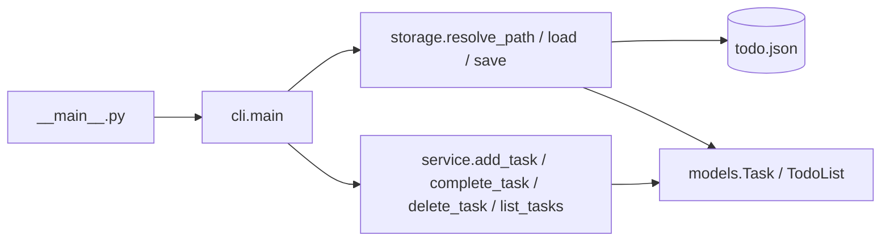

# test_project 설계

- 명세: docs/01_spec.md
- 상태: 확정 (2026-10-03)

## 개요
`python -m todo <명령> [인자]`로 실행하는 단일 파이썬 패키지 CLI다.
계층은 세 개로 나눈다. `cli`는 인자 해석과 출력·종료 코드만, `service`는 할 일 규칙(번호 부여, 검증, 완료, 삭제)만,
`storage`는 JSON 파일 읽기·쓰기와 경로 결정만 맡는다. 매 실행마다 `저장 파일 읽기 → 메모리에서 처리 → (변경 시) 저장`의 한 흐름으로 끝난다.
외부 라이브러리는 쓰지 않는다(표준 라이브러리만).



## 기술 스택
| 항목 | 선택 | 이유 |
|---|---|---|
| 언어 | Python 3.12 (3.11 호환, `requires-python = ">=3.11"`) | 회사 표준 + 명세 제약(3.11 이상) |
| 런타임 의존성 | 없음 (표준 라이브러리만: `json`, `os`, `sys`, `pathlib`, `tempfile`, `dataclasses`, `re`) | 명세 제약 |
| 인자 해석 | 직접 해석 (`argparse` 사용 안 함) | `argparse`는 영어 오류 메시지와 종료 코드 2를 내는데, 명세는 한국어 출력이고 종료 코드 2는 저장 파일 오류 전용이다 |
| 저장 | JSON 파일 1개 (UTF-8) | 명세 AC-1, AC-10에서 정해짐 |
| 테스트 | pytest (개발 의존성) | 회사 표준 |
| 린트·포맷 | ruff (개발 의존성, 회사 공통 `ruff.toml` 상속) | 회사 표준 |

타입 검사 도구(mypy 등)는 회사 표준 Makefile에 없고 추가 의존성이 되므로 넣지 않는다. 공개 함수의 타입 힌트는 리뷰에서 확인한다.

## 폴더 구조
```
test_project/
├── src/todo/
│   ├── __init__.py     # 빈 파일 (패키지 표시)
│   ├── __main__.py     # `python -m todo` 진입점. cli.main() 호출만
│   ├── cli.py          # 인자 해석, 출력(print 허용), 종료 코드
│   ├── service.py      # 할 일 규칙: 추가·조회·완료·삭제, 제목 검증, 번호 해석
│   ├── storage.py      # 저장 경로 결정, JSON 읽기·쓰기
│   ├── models.py       # Task, TodoList 데이터클래스
│   └── errors.py       # 예외 클래스
├── tests/
│   ├── unit/           # developer
│   └── acceptance/     # qa
├── pyproject.toml
├── Makefile
├── .env.example
└── .gitignore
```

## 공통 데이터 모델
```python
@dataclass
class Task:
    id: int  # 1 이상
    title: str  # 입력 그대로 저장 (양끝 공백 제거하지 않음)
    done: bool = False


@dataclass
class TodoList:
    next_id: int = 1  # 다음에 부여할 번호. 삭제해도 줄지 않는다
    tasks: list[Task] = field(default_factory=list)
```

### 저장 파일 형식
```json
{
  "next_id": 3,
  "tasks": [
    {"id": 1, "title": "우유 사기", "done": true},
    {"id": 2, "title": "운동", "done": false}
  ]
}
```
- 인코딩 UTF-8, `ensure_ascii=False`, `indent=2`, 끝에 줄바꿈 하나.
- 경로: 환경변수 `TODO_FILE`이 있고 빈 문자열이 아니면 그 값, 아니면 `Path("todo.json")`(실행 시점 현재 폴더 기준 상대 경로).
- 파일이 없으면 빈 목록(`TodoList()`)으로 본다. 읽기만 하는 명령(`list`)이나 실패한 명령은 파일을 만들지 않는다.
- `next_id`를 저장하므로 삭제된 번호는 다시 쓰지 않는다(AC-2).
- 쓰기는 같은 폴더에 임시 파일을 만든 뒤 `os.replace`로 바꿔치기한다(쓰다 실패해도 기존 파일이 깨지지 않게).

### "손상된 파일"의 정의 (AC-10)
다음 중 하나면 읽기 실패(`StorageError`)로 처리하고 파일을 건드리지 않는다.
- 파일을 열거나 읽을 수 없음(`OSError`, 예: 경로가 폴더, 이름이 너무 김. `path.exists()` 호출 중 난 것도 포함), UTF-8 디코딩 실패(`UnicodeDecodeError`), JSON 문법 오류(`json.JSONDecodeError`)
- `json.loads`가 그 밖의 이유로 해석하지 못함: 너무 깊게 중첩됨(`RecursionError`), 정수 자릿수 한도 초과 등(`ValueError`). `RecursionError`는 `json.loads` 호출만 감싸서 잡는다(다른 코드의 재귀 버그를 가리지 않게)
- 최상위가 객체가 아니거나 `next_id`·`tasks` 키가 없음
- `next_id`가 `int`(bool 제외)가 아니거나 1 미만
- `tasks`가 리스트가 아니거나, 항목이 객체가 아니거나, `id`가 1 이상 `int`(bool 제외)가 아니거나, `title`이 `str`이 아니거나, `done`이 `bool`이 아님
- `id` 중복, 또는 `next_id`가 가장 큰 `id` 이하

## 오류 처리
| 상황 | 출력 (표준 오류) | 종료 코드 | 저장 |
|---|---|---|---|
| 명령 없음, 알 수 없는 명령, 인자 개수 틀림 | `오류: 사용법: python -m todo add "<제목>" \| list \| done <번호> \| delete <번호>` | 1 | 안 함 |
| 제목이 비었거나 공백뿐 (AC-3) | `오류: 제목을 입력하세요` | 1 | 안 함 |
| 제목 100자 초과 (AC-4) | `오류: 제목은 100자 이하여야 합니다` | 1 | 안 함 |
| `done`/`delete` 번호가 없거나 숫자가 아님 (AC-9) | `오류: #<입력값> 할 일을 찾을 수 없습니다` | 1 | 안 함 |
| 저장 파일 읽기 실패 (AC-10) | `오류: 저장 파일을 읽을 수 없습니다: <경로>` | 2 | 안 함 |
| 저장 파일 쓰기 실패 (UTF-8로 인코딩할 수 없는 제목 포함, 아래 참고) | `오류: 저장 파일을 쓸 수 없습니다: <경로>` | 2 | 기존 파일 유지 |

- `<경로>`는 `str(path)` (환경변수 값 또는 `todo.json` 그대로, 절대 경로로 바꾸지 않음).
- `<입력값>`은 사용자가 준 문자열 그대로.
- 정상 출력(추가됨/목록/완료/이미 완료됨/삭제됨)은 표준 출력, 종료 코드 0.
- 검사 순서: ① 명령·인자 개수 → ② (`add`만) 제목 검증 → ③ 파일 읽기 → ④ 처리(번호 찾기 등) → ⑤ 변경이 있으면 저장.
  따라서 `add`의 제목 오류는 파일 상태와 관계없이 종료 코드 1, `done`/`delete`는 파일이 손상되었으면 번호와 관계없이 종료 코드 2.
- UTF-8로 인코딩할 수 없는 제목(잘못된 UTF-8 인자가 `sys.argv`에서 서로게이트 문자 `\udc80`~`\udcff`로 들어온 경우):
  제목 검증(②)은 이를 따로 검사하지 않는다(명세의 제목 오류는 AC-3·AC-4 두 가지뿐). 저장(⑤)에서 바이트로 바꾸다 실패하므로
  "저장 파일 쓰기 실패"로 처리한다. 임시 파일을 만들기 전에 실패하므로 기존 파일과 폴더는 그대로이고, 표준 출력에는 아무것도 쓰지 않는다.
  저장되지 않으므로 이후 `list`·`done`·`delete` 출력에 서로게이트 문자가 나올 일은 없다.

명세에 없어 설계에서 정한 항목(PM 확인 필요): 사용법 오류 메시지와 종료 코드 1, 쓰기 실패 메시지와 종료 코드 2,
제목을 입력 그대로 저장(양끝 공백 제거 안 함)하고 길이는 `len(title)`(파이썬 문자 수)로 셈, `add`의 인자는 정확히 1개(따옴표 없이 여러 단어를 주면 사용법 오류),
UTF-8로 인코딩할 수 없는 제목은 쓰기 실패(코드 2)로 처리.

## 실행 방법
| 명령 | 하는 일 |
|---|---|
| `make setup` | `.venv` 생성 후 `pip install -e ".[dev]"` (pytest, ruff) |
| `make check` | `ruff check .` + `ruff format --check .` + `pytest -q` (단위·인수 테스트 전체). 품질 게이트가 사용 |
| `make lint` | 린트와 포맷 확인만 |
| `make test` | `pytest -q`만 |
| `make run ARGS='add "우유 사기"'` | `PYTHONPATH=src $(PY) -m todo $(ARGS)` 실행 |

직접 실행: `make setup` 후 `.venv/bin/python -m todo list` (또는 설치 없이 `PYTHONPATH=src python3 -m todo list`).
저장 위치 변경: `TODO_FILE=/tmp/my.json python -m todo list`.

## 마일스톤
| ID | 이름 | 포함 AC | 선행 |
|---|---|---|---|
| M1 | 할 일 관리 기본 기능 | AC-1 ~ AC-10 | - |

## 변경 이력
| 날짜 | 바뀐 부분 | 이유 |
|---|---|---|
| 2026-10-03 | 최초 작성 | 명세 승인에 따른 설계 |
| 2026-10-03 | "손상된 파일의 정의"에 `json.loads`의 `RecursionError`·`ValueError`, `path.exists()` 중 `OSError` 추가 | T-02-r1 #3, #1: 깊은 중첩·큰 정수 JSON과 존재 확인 실패가 `StorageError`로 바뀌지 않아 AC-10(읽을 수 없으면 코드 2)과 어긋남 |
| 2026-10-03 | "오류 처리"에 UTF-8 인코딩 불가 제목 = 쓰기 실패(코드 2)로 명시 | T-02-r1 #4: 처리 위치가 없어 트레이스백과 임시 파일 잔존 발생. 명세에 없는 새 메시지를 만들지 않도록 기존 쓰기 실패 처리에 포함 |
